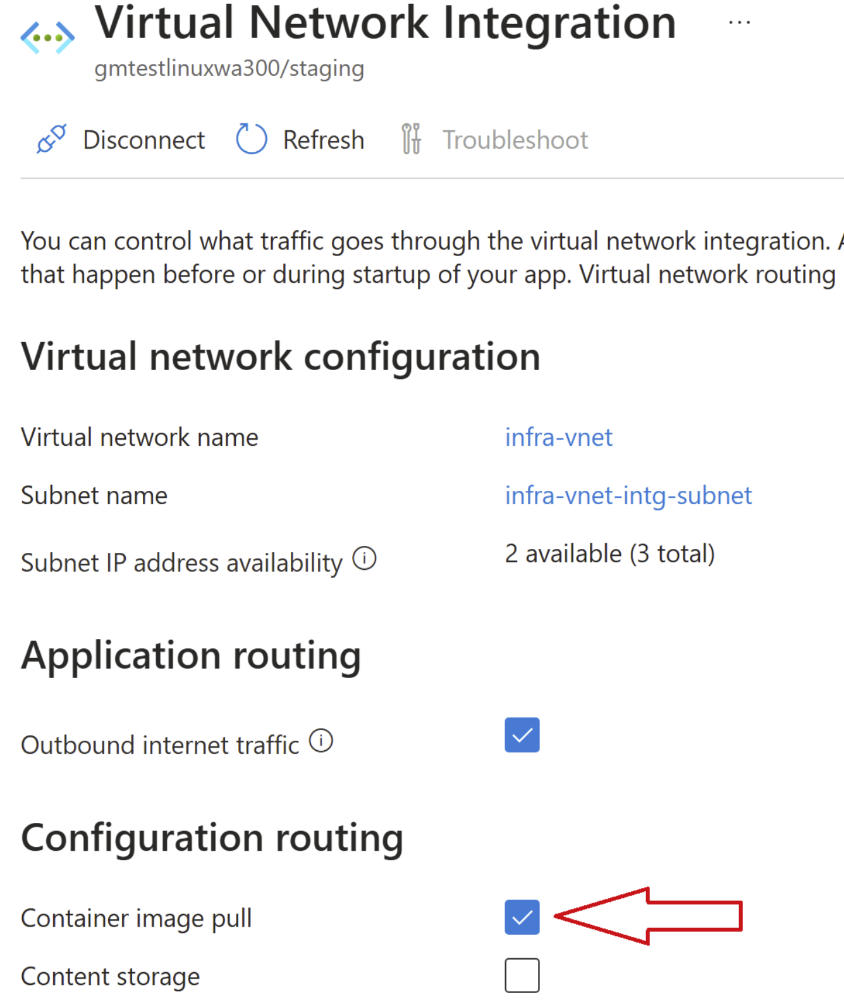
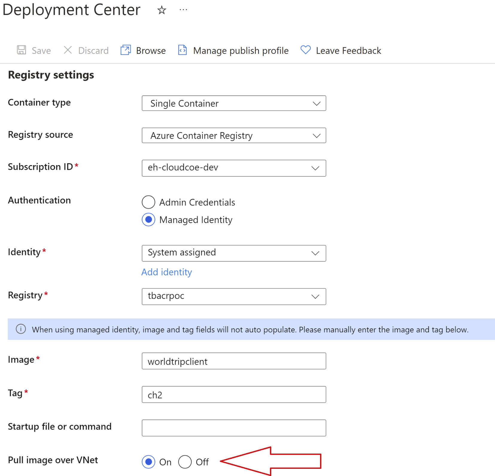

# Web App - Windows OS example

> This example shows how to create a Linux Web App that supports docker container deployment.
> The deployment targets the web app deployment staging slot only where a dev team can then use a pipeline to perform the swap to a Production slot. Deployment to a Production slot can also be performed if not using another deployment slot. The example includes code to deploy to Production slot. See the commented out under: #How to deploy docker container to a Production slot
>
> When deploying a docker container, make sure the following settings are enabled. See reference images below.
>
> * Virtual Network Integration/Configuration Routing/Container Image Pull
> * Deployment Center/Registry Settings/Pull Image over VNet
>
> 
>
> 
>
>
> Currently the terraform azurerm provider has no support to enable the "Container Image Pull" under the virtual network integration blade.
> Some options that are available:
>
> * Use the AZAPI terraform provider outside of the module. This example shows how that is done
> * Use CLI
> * Manually enable it from the portal
>
> Observations:
>
> * The web app will need to be restarted on the initial deployment. Any subsequent deployments did not require a restart.
>   This can be done programatically:
>   * Pipeline
>   * CLI
>   * Manually
>
> The module will create the following resources and configurations:
>
> * Windows WebApp
>
>   * Docker deployment (Code commented out for Production slot deployment)
>   * VNet Integration
>   * Private Endpoint
>   * Custom App Settings
>   * Sticky Settings (for use with Slots)
>   * CORs support
>   * Public Network Access Disable
>   * App Scaling
>   * Diagnostic settings
>   * Require Tags
>   * System Identity
> * App Service Plan
>
>   * Using Standard Plan
> * WebApp Slot
>
>   * Docker container deployment
>   * Private endpoint & vnet integration
>   * App Insights
>   * Diagnostic settings
> * Managed Identity Role assignments:
>
>   * WebApp and Storage Account
>   * WebApp and ACR
>   * Web App Slot and ACR
> * App Insights
>
>   * Includes Log Analytics Workspace
> * Alerts
>
>   * Includes connection to Alarm Funnel Action Group
>   * New Action Group for email alerts outside of Alarm Funnel
>   * Several FMEA Alerts
>
> # Dependencies
>
> * Existing VNet\Subnets for VNet Integration and Private Endpoints
> * Existing Private DNS Zone
> * Existing Log Analytics Workspace for Diagnostic Settings
> * Existing Azure Container Registry using private endpoints and public network access disabled
>
> ## Links
>
> * [How to use Docker YAML to build and push Docker images to Azure Container Registry](https://learn.microsoft.com/en-us/azure/devops/pipelines/ecosystems/containers/acr-template?view=azure-devops)
> * [How to deploy a custom container to Azure App Service with Azure Pipelines](https://learn.microsoft.com/en-us/azure/devops/pipelines/apps/cd/deploy-docker-webapp?view=azure-devops&tabs=java%2Cyaml)
